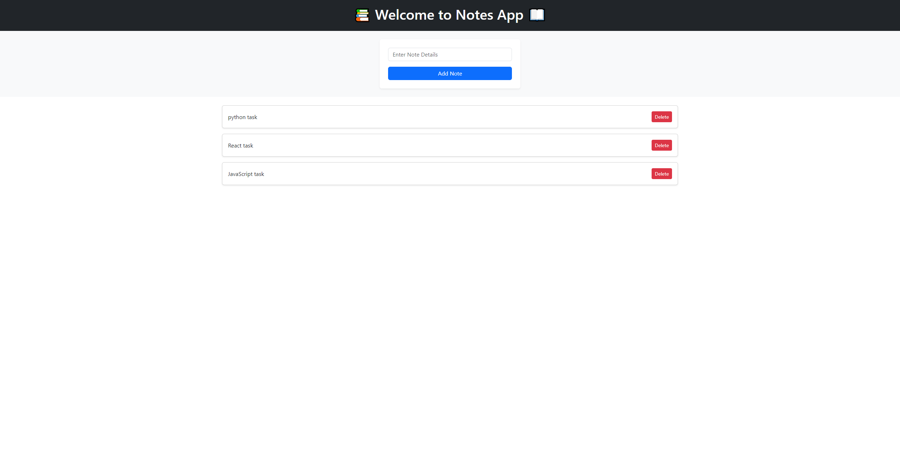

# React Notes App 📝

<p align="center">
  
</p>

React Notes App is a lightweight and user-friendly note-taking web application built using React. It allows users to effortlessly create, edit, and manage their notes in a responsive and intuitive interface.

## Key Features

- **Create and Edit Notes:** Easily add new notes and modify existing ones with a rich text editor.
- **Delete Notes:** Remove notes you no longer need with a simple click.
- **Responsive Design:** Ensures a seamless experience across desktop and mobile devices.
- **Local Storage:** Utilizes the browser's local storage for data persistence, ensuring notes are saved even if the browser is closed.

## Demo



## Getting Started

To get the React Notes App running locally on your machine, follow these steps:

1. **Clone the Repository:**
   ```
   git clone https://github.com/abdulrahim-ramadan/React-notes.git
   ```

2. **Navigate to the Project Directory:**
   ```
   cd React-notes
   ```

3. **Install Dependencies:**
   ```
   npm install
   ```

4. **Run the App:**
   ```
   npm start
   ```

5. **Open in Browser:**
   ```
   Open http://localhost:3000 to view the app in your browser.
   ```

## Technologies Used

- React.js
- HTML5 & CSS3
- JavaScript (ES6+)

## Contributing

Contributions are welcome! If you have any ideas, suggestions, or bug fixes, please submit a pull request.

## License

This project is licensed under the MIT License - see the [LICENSE](LICENSE) file for details.

## Contact

For any questions or feedback, feel free to reach out:

- Email: abdalrhim19991@hotmail.com
- GitHub: [abdulrahim-ramadan](https://github.com/abdulrahim-ramadan)

Enjoy using React Notes App! 🚀
